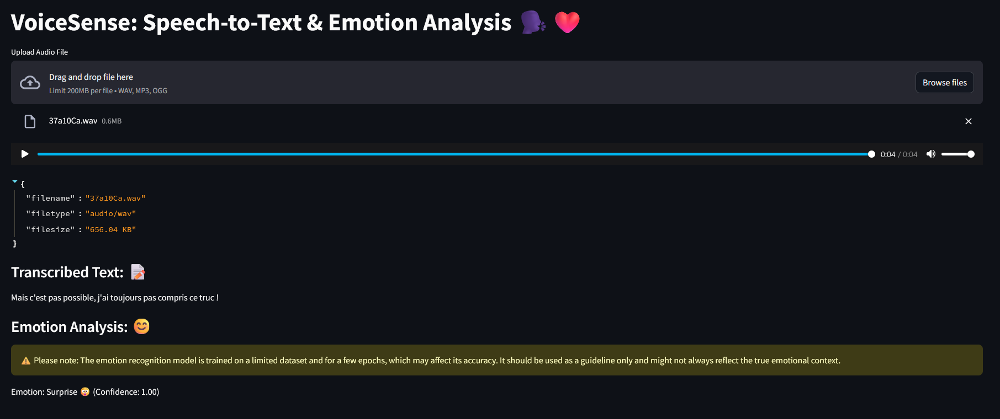

# VoiceSense: Speech-to-Text & Emotion Analysis 🗣️❤️

VoiceSense is a web application that transcribes speech and analyzes the emotion of the speaker. It is built with [Streamlit](https://streamlit.io/).



### Author

**Habib ADOUM MANDAZOU**

# Installation

#### Clone the repository

```shell
$ git clone https://github.com/GhostDragon01/EmotiveSpeechTranscriber.git
```
```shell
$ cd EmotiveSpeechTranscriber
```

#### Create a virtual environment (optional but recommended)

```shell
$ python3 -m venv venv
```

#### Install dependencies

```shell
$ pip install -r requirements.txt
```

# Usage

```shell
$ streamlit run app.py
```

During the first run, the application will download the necessary models and dependencies. This may take a few minutes depending on your internet connection.

# Models

The application uses the following models:

- [OpenAI's Whisper](https://github.com/openai/whisper) for speech-to-text transcription

- [jonatasgrosman/wav2vec2-large-xlsr-53-french](https://huggingface.co/jonatasgrosman/wav2vec2-large-xlsr-53-french) wav2vec2 model fine-tuned on French. I fine-tuned this model on the [Canadian French Emotional Speech Dataset](https://zenodo.org/records/1478765) for emotion analysis.

# Contributing

Contributions are welcome! Feel free to open an issue or submit a pull request if you have any questions or suggestions.

# License

[MIT](LICENSE) © Habib ADOUM MANDAZOU

